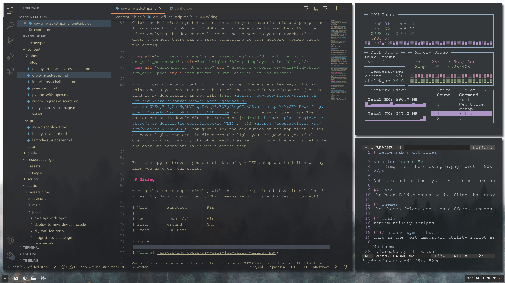

# leobeosab's dot files

    

Dots are put on the system with sym links so changes are kept in sync with the repo at all times

## Base
The base folder contains dot files that stay consistant throughout themes such as vimrc, zshrc etc.

## Themes
The themes folder contains different themes I use on Arch across my devices and contain i3, polybar and other config files

## Utils
random utility scripts

#### create_sym_links.sh
This is the most important utility script as it will change your system dot files to sym links to a ~/dots directory where this repo should reside.

No theme
`./create_sym_links.sh`

Theme
`./create_sym_links.sh pixel`

## vim notes
Vim needs neo vim for some of its python dependencies. 
`pip install neovim` should fix any errors
